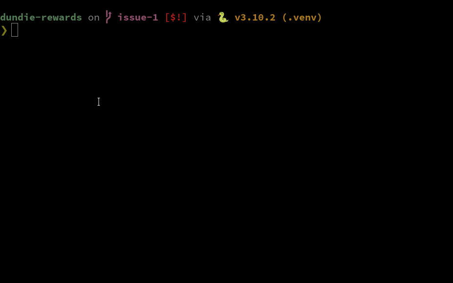

# Projeto Dundie Rewards

[](https://github.com/rochacbruno/dundie-rewards/actions/workflows/main.yml)

Nós fomos contratados pela Dunder Mifflin, grande fabricante de papéis para desenvolver um sistema
de recompensas para seus colaboradores.

Michael, o gerente da empresa quer aumentar a motivação dos funcionários oferecendo um sistema
de pontos que os funcionários podem acumular de acordo com as suas metas atingidas, bonus oferecidos
pelo gerente e os funcionários podem também trocam pontos entre sí.

O funcionário pode uma vez a cada ano resgatar seus pontos em um cartão de crédito para gastar onde
quiserem.

Acordamos em contrato que o MVP (Minimum Viable Product) será uma versão para ser executada no terminal
e que no futuro terá também as interfaces UI, web e API.

Os dados dos funcionários atuais serão fornecidos em um arquivo que pode ser no formato .csv ou .json
e este mesmo arquivo poderá ser usado para versões futuras. `Nome, Depto, Cargo, Email`


## Instalação

Installe o UV https://docs.astral.sh/uv/getting-started/installation/

```bash
curl -LsSf https://astral.sh/uv/install.sh | sh
```

e então execute na raiz deste repositório.

```py
uv sync
uv tool install . -e
```

## Uso no CLI

```py
dundie --help
```

DICA: tambem pode usar `uv run dundie` se preferir.




## Uso no desktop

```bash
dundie-app
```

https://github.com/user-attachments/assets/3ba418ac-7ac8-4bc8-a0ee-615eaec7f431


## Uso no web browser

```bash
dundie-app --web
```

then open http://127.0.0.1:5000/

## Uso no Android ou iOS


DICA: No mac + iphone ao invés de `--android` use `--ios`

```bash
uv run flet run --android dundie/app.py

App is running on: http://192.168.1.132:8551/dundie/app.py

█████████████████████████████████████████
█████████████████████████████████████████
████ ▄▄▄▄▄ █   ▄█ █ ▀▄▄▄ ▀█ ▀█ ▄▄▄▄▄ ████
████ █   █ █▀█ ▄ █▀█▀▄ ▀▄ █ ▄█ █   █ ████
████ █▄▄▄█ ███▄▄▄  ██▄ ▀▄▄ ▄ █ █▄▄▄█ ████
████▄▄▄▄▄▄▄█ ▀▄█ ▀ █▄▀▄█▄█ ▀ █▄▄▄▄▄▄▄████
████ █  ▀▄▄▄█ ▀██▄██▀  ▀█▄█ ██ ▀█ ▀▄▄████
████▀▄▄█▄▀▄█▀▀█  ▀  ▀▄▄▀ ██ █ █ ▄ █ ▀████
██████ ▄▀ ▄█ ▀▀▄▄██▄▀▀ █ ▄▀▀█▄ ██▄█ ▄████
█████▀    ▄█   ▀▄ ▄▄ █▄▄▀▀██ ▀ ▀▀█ ██████
█████  ▄▀▀▄▀▄▀█▄▀█▄  ▀ ▄▀ ▀▀   █  ▄█▀████
████▄▀▄▀ ▀▄▄▀█▄▀█ ▀▄█ ██▄██▀ ▀▀▄ █▄██████
████ █▄ ▀ ▄ ▄ ▄▄█ █▀██ ▄ █▀█▄█▀█ ▄ █▀████
█████▀▄▄█▄▄ ▀█▀█  ██ █▄▀▄▄  ▄█▄▄█ ▄ ▄████
████▄█▄▄█▄▄█▀▀▄ ▀▀█▄▄ ▄ █▀▄▀ ▄▄▄  █▀▄████
████ ▄▄▄▄▄ █ ▄ █▄▄▀▄▀█▀▄▀▀   █▄█ ▀▀▀▀████
████ █   █ █▀  ▀ ▄ ██▄█ ▀█ ▄ ▄▄ ▄▀▄██████
████ █▄▄▄█ █▄█▀▀▄▀▄▀▀█▄  █▄ ██  ▀  █▀████
████▄▄▄▄▄▄▄█▄▄███▄█▄█▄███▄██████▄████████
█████████████████████████████████████████
▀▀▀▀▀▀▀▀▀▀▀▀▀▀▀▀▀▀▀▀▀▀▀▀▀▀▀▀▀▀▀▀▀▀▀▀▀▀▀▀▀
```

Instale a app `flet` no seu celular e então escaneie o  QRCode, seu computador e o celular devem estar na mesma rede wi-fi.

Detalhes em https://flet.dev/docs/publish